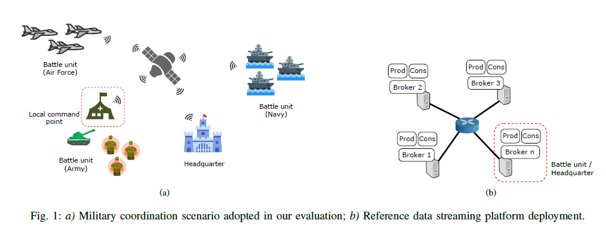
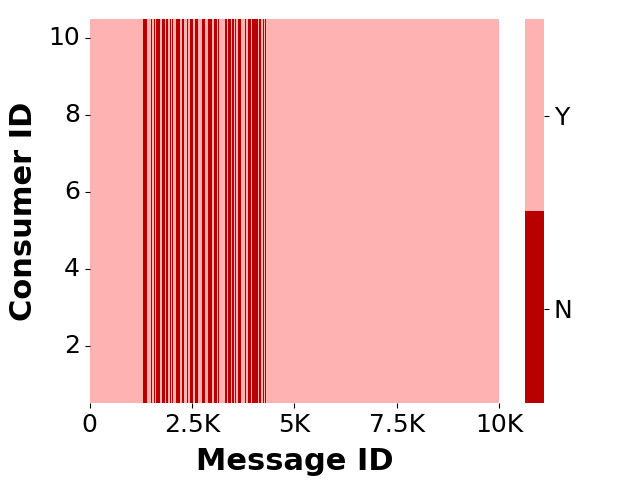

## Setup
We compare the suitability of different data streaming platforms to a mission-critical deployment by evaluating their
capabilities in a military coordination scenario. Figure 1(a) depicts our application scenario. We assume several battle units on land, air, and sea communicating over a tactical network. Each unit comprises multiple members such as soldiers and air crafts that must share information (e.g., position reports) both within and in between units. Each unit is also organized into a star topology meaning that the communication always flows through a local command point (red dashed boxes). Different units connect to each other through a satellite network. Figure 1(b) presents our reference deployment
architecture. We assume a cluster based setup where each battle unit hosts a message broker (i.e., cluster node) located
at its local command point. We replicate message queues (or logs) among all nodes participating in the cluster to ensure
they remain operational upon a battle unit disconnection.

## Parameter Tuning Experiment Result

we observe approximately 85% decrease in the total bandwidth demand from Kafka post optimization. This finding is a testament to the significant network bandwidth savings that can be achieved through meticulous parameter tuning up to an order of magnitude in certain instances.

## Disconnection Experiment Result

To test the system behavior under network-partitioned conditions, we randomly disconnect the node hosting the leader broker for one of the two topics for 120 seconds (approximately 20% of the total experiment duration).

Figure shows the data delivery matrix for the producer that is co-located with the disconnected broker. Each cell indicates whether a message was received by a given consumer (light color) or not (dark color). We can observe intermittent losses for messages produced during the disconnection period (dark vertical bars). Moreover, all lost messages come from the topic whose leader got disconnected. This is in line with previous results found in the literature and is due to the ZooKeeper (the distributed coordination service used by Apache Kafka) data consolidation mechanism, which may discard data (or pull it from an outdated log) during the partition merging process after a re-connection. We were not able to observe a similar behavior in the more recent Raft-based Kafka.